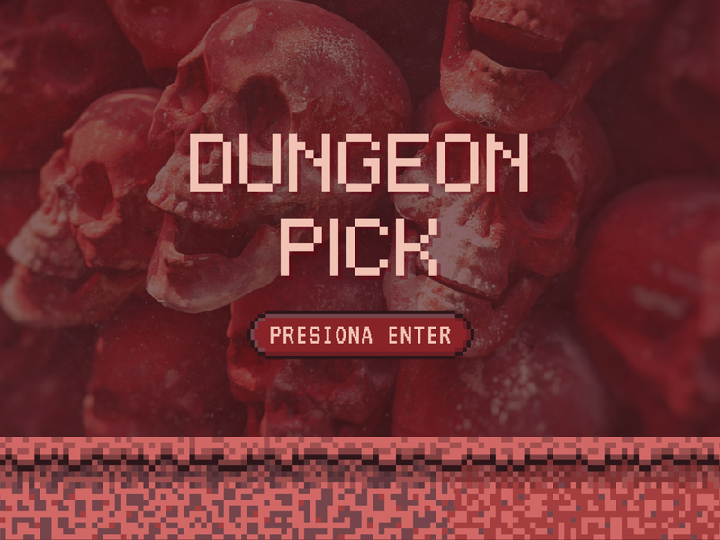
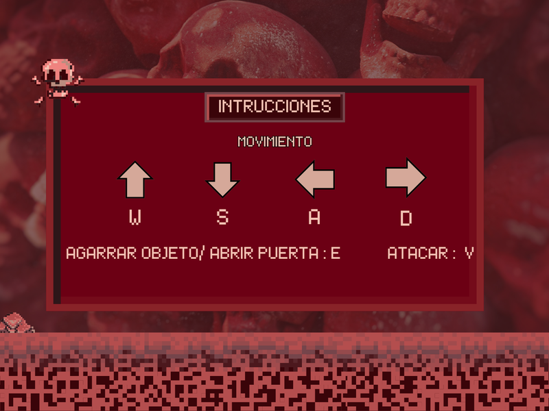
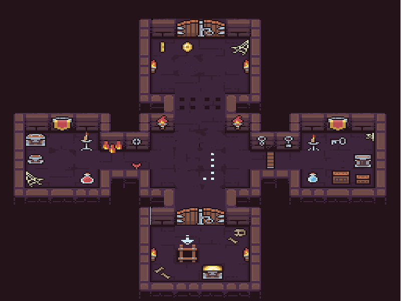
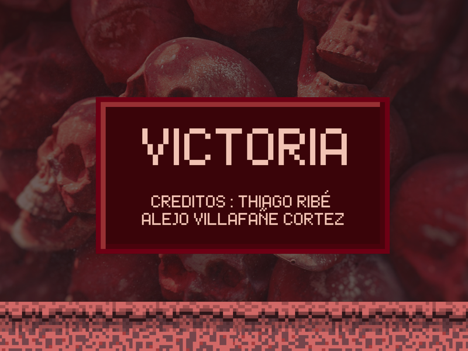
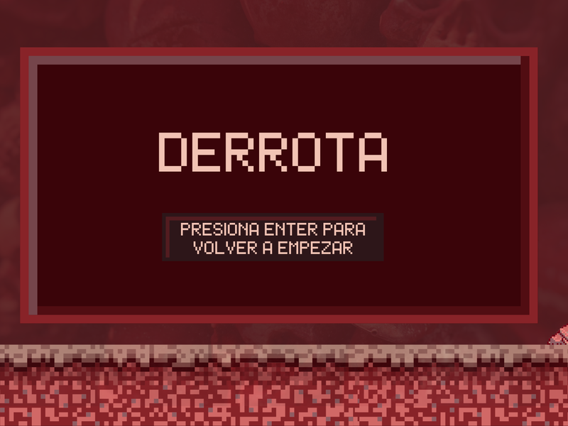

# 🗡️ DUNGEON PICK ⚰️

## 🧛‍♂️🧛🏻‍♂️ Equipo de desarrollo

- Thiago Daniel Ribe 
- Alejo Matias Villafañe Cortez

## 🏰 Capturas
Pantalla de Inicio

Pantalla con Intrucciones

Pantalla Mazmorra

Pantalla De Victoria

Pantalla De Derrota

## 📜 Reglas de Juego / Instrucciones

Objetivo : Derrotar a esbirros y recoger sus objetos para luego vencer al Jefe.

🕹️ Controles :
* Movimientos : W(ARRIBA),A(IZQUIERDA),S(ABAJO),D(DERECHA)
* Ataque/Agarrar Objeto : V

## 💿 Otros

- Programación Orientada a Objetos I - UNAHUR (Universidad Nacional de Hulingham)
- Versión de wollok
- Una vez terminado, no tenemos problemas en que el repositorio sea público / queremos manternerlo privado
